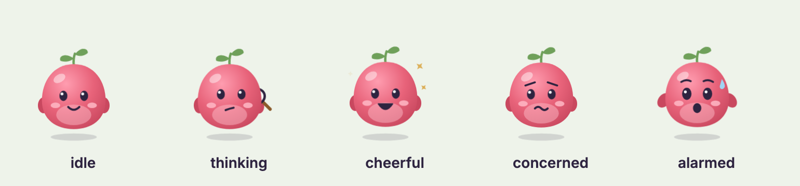
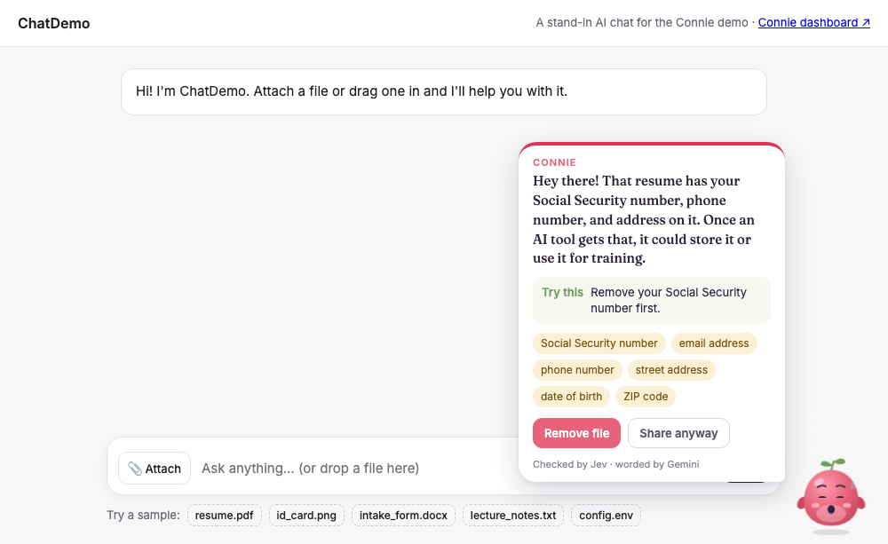
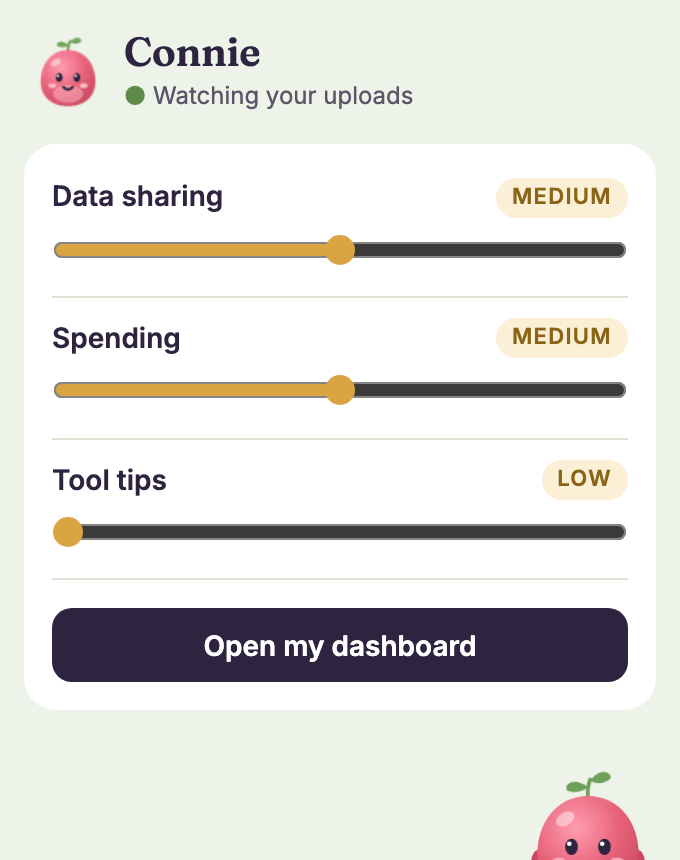

# Connie

**ShellHacks 2026** · Assurant "Take Control of AI" · MLH Gemini API · MLH Snowflake API

Connie is a small, animated helper who lives in your browser. When you're about to hand a file to an AI tool (a resume, a photo of your ID, a `.env` full of keys), she **holds it at the door**, checks it, and tells you in plain English what's inside before you decide. Three sliders set how careful she is. A dashboard shows your AI spending, suggests better tools, and lets you ask questions about your own history.

> *Jev decides fast, Gemini explains kindly, Snowflake remembers.*



| Connie stops a resume with an SSN | The toolbar popup |
|---|---|
|  |  |

---

## How it works

```
 file picked / dropped / pasted into an AI chat
        │   Connie holds the event (capture phase, before the site sees it)
        ▼
 backend  ── extract text ──►  PDF · DOCX locally, images via Gemini (multimodal)
        │
        ├─ Jev (TypeSafe System One): 5 typed yes/no questions, one per data category
        │     the sensitivity slider decides which categories count and how sure Jev must be
        ├─ Gemini (structured output): { message, tip, mood } in Connie's voice
        └─ Snowflake (REST SQL API): log it with a Gemini embedding in a VECTOR column;
              "ask your history" = vector search in Snowflake → Gemini writes the answer
        ▼
 Connie reacts (mood + advice) → Remove file (never reaches the site) or Share anyway (released)
```

Every service has a fallback, so the demo never dies on stage. If Jev is down, regex rules take over. If Gemini is down, template wording is used. If Snowflake is down, history lives in memory. If the whole backend is down, Connie lets the file through rather than breaking the site. Each response says which engines actually ran, and Connie shows it in small print ("Checked by Jev · worded by Gemini").

| Challenge | What Connie does for it |
|---|---|
| **Assurant: real control** | She doesn't just warn. The upload is held until you choose, and Remove means the site never gets the file. Sliders change what she catches. |
| **Gemini** | Structured output (a Pydantic schema) for every message. Multimodal: reads photos and screenshots. Explains Jev's tool picks. |
| **Snowflake** | Connie's memory and retrieval engine, all over the REST SQL API with a programmatic access token. It stores settings and the interaction log, keeps a `VECTOR(FLOAT, 768)` embedding per entry, and does the semantic search for "ask your history" with `VECTOR_COSINE_SIMILARITY` (RAG with Snowflake as the vector store). With Snowflake AI features enabled, `SNOWFLAKE_SEARCH=cortex` switches retrieval to Cortex Search and the answer to Cortex COMPLETE (`05_cortex_optional.sql`). |

---

## Run it

```bash
cd backend
python3 -m venv .venv
.venv/bin/pip install -r requirements.txt
cp .env.example .env        # add keys (see "Keys" below); blanks fall back gracefully
.venv/bin/python app.py     # http://localhost:5050
```

| URL | What it is |
|---|---|
| http://localhost:5050/demo/ | A stand-in AI chat. Use **Try a sample** to attach the demo files. |
| http://localhost:5050/app/ | Dashboard: sliders, spending, tool picker, ask your history |

### Install the extension

1. Chrome → `chrome://extensions` → turn on **Developer mode**
2. **Load unpacked** → choose the `extension/` folder
3. Pin Connie from the puzzle-piece menu. Her popup has the sliders and a dashboard link.

She works on `/demo/`, chatgpt.com, claude.ai, and gemini.google.com. Keep the backend running. Without the extension, `/demo/` loads the same scripts itself, so the demo still works.

---

## Keys

All keys go in `backend/.env`, which is git-ignored. Edits take effect when the dev server reloads.

- **Gemini:** [aistudio.google.com](https://aistudio.google.com) → Get API key → `GEMINI_API_KEY`.
- **Jev:** TypeSafe AI key → `TYPESAFE_API_KEY`. API docs: [docs.typesafe.ai/api](https://docs.typesafe.ai/api).
- **Snowflake:**
  1. In a Snowsight worksheet, run `snowflake/01_schema.sql` → `02_seed.sql` → `03_vector.sql` → `04_access.sql`.
  2. `04_access.sql` creates a narrow `CONNIE_APP` role and prints a programmatic access token **once**. Copy `token_secret` into `SNOWFLAKE_PAT`.
  3. Set `SNOWFLAKE_ACCOUNT` to your account identifier (the `myorg-myaccount` part of your Snowflake URL).
  4. The seed entries get their embeddings the first time someone asks a question.

  PATs normally require a network policy. `04_access.sql` relaxes that for PATs only, since a hackathon laptop's IP keeps changing.

  Self-service **trial accounts can't use Cortex AI functions** until a credit card is added ("AI function COMPLETE is not available for trial accounts"). That's why the default search is vector-based. If you get an AI-enabled account, run `05_cortex_optional.sql` and set `SNOWFLAKE_SEARCH=cortex`.

---

## Sliders

| Pillar | Slider | Low | Medium | High |
|---|---|---|---|---|
| **Data sharing** | Sensitivity | IDs, card/bank numbers, passwords and keys | + address, phone, email, date of birth | + names, schools/employers, ZIP, health |
| **Spending** | Strictness | Over budget only | + 3+ tools doing the same job | + any overlap and barely-used tools |
| **Tool selection** | Assertiveness | Only when you ask | Quiet suggestion while typing | Connie pops in while typing |

---

## Demo script (~3 min)

1. `/demo/` → **resume.pdf** → Connie grabs the magnifying glass, then turns alarmed: SSN, address, phone. The file is *not* attached.
2. **Remove file** → it never reaches the chat. *"She doesn't just warn you, she gives you control."*
3. **id_card.png** → Gemini reads the photo, and Connie catches the license number.
4. **lecture_notes.txt** on Medium → safe. Slide **Data sharing** to High in the popup → try again → she flags the name and school.
5. Dashboard → pause a duplicate subscription, then ask the tool picker "summarize a 200-page PDF".
6. **Ask your history:** "when did I share my address?" → Snowflake finds the matching entries by meaning, and Connie answers from your own log.

---

## Repo layout

```
API_CONTRACT.md        endpoint shapes; change them here first
backend/
  app.py               endpoints and the fallback chain
  connie/jev.py        TypeSafe System One: data categories + tool choice
  connie/gemini.py     structured output: advice, tool reasons, image reading
  connie/snow.py       Snowflake SQL API: settings, log, vector search (or Cortex)
  connie/extract.py    PDF / DOCX / image → text
  connie/rules.py      regex detector + template wording (fallbacks)
extension/
  connie-ui.js         Connie: SVG character, moods, peek, speech bubble (shared)
  connie.css           her look and animations
  content.js           holds uploads, calls the backend, drives Connie
  background.js        API proxy (HTTPS sites can't call localhost)
  popup.*              toolbar popup
  demo/                stand-in AI chat + sample files (all fake data)
webapp/                dashboard
snowflake/             01 schema · 02 seed · 03 vector column · 04 role + token · 05 Cortex (optional)
```

All personal data in the samples is made up. The ID card is marked SPECIMEN.
